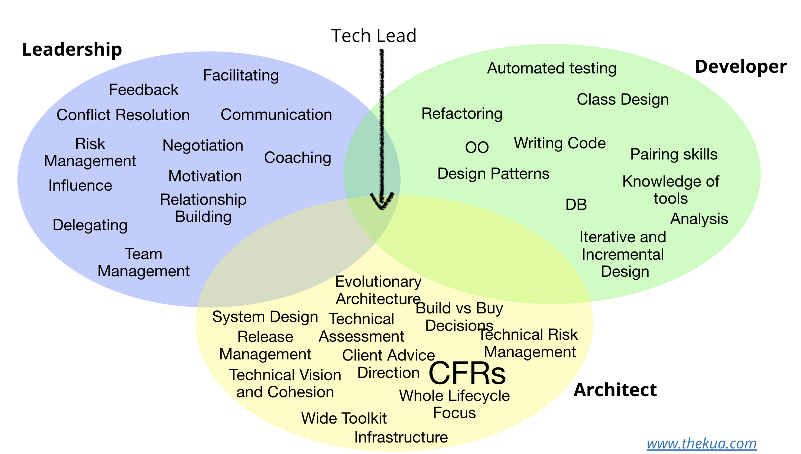

# TL 职责

## PM(P) vs TL(T)

| 角色 | 职责     | 描述                                                                                                     |
| ---- | -------- | -------------------------------------------------------------------------------------------------------- |
| P\T  | 阻止     | 防止项目上一些不好的事情发生，比如资源超过限制                                                           |
| P\T  | 资源     | 给团队提供工作所需的资源，保障团队工作畅通无阻                                                           |
| P\T  | 技术导航 | 将关键的技术进行合理导航，合适的人做合适的事情，同时兼顾人员的能力成长，比如 Junior 的人得到最需要的指导 |
| P\T  | 做决定   | 通过对比不同的方案，风险和项目目标，做出非常靠谱的决定                                                   |
| P\T  | 价值展现 | 将价值或者知识做团队和客户层面的呈现，赢得团队和客户的信任                                               |
| T    | 知识     | 按团队所需，为所有人呈现所需的知识，做团队中最可靠的知识传播者                                           |
| T    | 指导     | 指导普通开发解决技术难题                                                                                 |
| P    | 责任     | 项目交付的总负责人，背锅侠                                                                               |
| P    | 团队     | 为团队创造一个好的工作范围，让所有人愉快的工作                                                           |

## TL(T) 与 架构师(A)

| 角色 | 职责         | 描述                                                                                                 |
| ---- | ------------ | ---------------------------------------------------------------------------------------------------- |
| T    | 梳理标准     | 为项目的代码质量树立高标准                                                                           |
| T    | 解决难题     | 解决项目上最难的技术问题                                                                             |
| A    | 技术深入理解 | 深入的技术理解和丰厚的技术背景，避免实现局部最优的方案甚至不成熟的方案                               |
| A    | 拉通和标准化 | 通过非常过硬的沟通技能，帮助组织或者部门就技术愿景和技术战略达成一致，为整个公司的技术标准化提供建议 |
| T\A  | 知识         | 按团队所需，为所有人呈现所需要的知识                                                                 |
| T    | 指导         | 指导普通开发解决技术难题                                                                             |
| T\A  | 转化         | 将产品的创意或者粗略想法转化为可靠的技术实现方案                                                     |

## SR DEV(D) vs TL(T)

| 角色 | 职责     | 描述                                                                 |
| ---- | -------- | -------------------------------------------------------------------- |
| D\T  | 树立标准 | 为项目代码质量树立高标准                                             |
| D\T  | 解决难题 | 解决项目最难的技术问题                                               |
| T    | 做决定   | 能够在复杂的团队客户协作情况下做出快速且靠谱的决定                   |
| T    | 整体理解 | 清楚的理解团队现在正在实施的工作的每一个细节，知道影响当前任务的因子 |
| T    | 展示价值 | 将价值或者知识做对团队和客户层面的呈现，赢得团队和客户的信任         |
| D\T  | 知识     | 按团队所需，为所有人呈现所需要的知识，做团队中最可靠的知识传播者     |
| D\T  | 指导     | 指导普通开发解决技术难题                                             |

