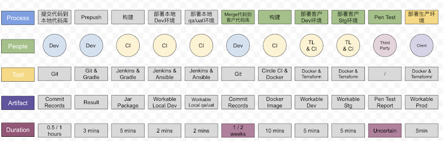

# TL 职责

## PM(P) vs TL(T)

| 角色 | 职责     | 描述                                                                                                     |
| ---- | -------- | -------------------------------------------------------------------------------------------------------- |
| P\T  | 阻止     | 防止项目上一些不好的事情发生，比如资源超过限制                                                           |
| P\T  | 资源     | 给团队提供工作所需的资源，保障团队工作畅通无阻                                                           |
| P\T  | 技术导航 | 将关键的技术进行合理导航，合适的人做合适的事情，同时兼顾人员的能力成长，比如 Junior 的人得到最需要的指导 |
| P\T  | 做决定   | 通过对比不同的方案，风险和项目目标，做出非常靠谱的决定                                                   |
| P\T  | 价值展现 | 将价值或者知识做团队和客户层面的呈现，赢得团队和客户的信任                                               |
| T    | 知识     | 按团队所需，为所有人呈现所需的知识，做团队中最可靠的知识传播者                                           |
| T    | 指导     | 指导普通开发解决技术难题                                                                                 |
| P    | 责任     | 项目交付的总负责人，背锅侠                                                                               |
| P    | 团队     | 为团队创造一个好的工作范围，让所有人愉快的工作                                                           |

## TL(T) 与 架构师(A)

| 角色 | 职责         | 描述                                                                                                 |
| ---- | ------------ | ---------------------------------------------------------------------------------------------------- |
| T    | 梳理标准     | 为项目的代码质量树立高标准                                                                           |
| T    | 解决难题     | 解决项目上最难的技术问题                                                                             |
| A    | 技术深入理解 | 深入的技术理解和丰厚的技术背景，避免实现局部最优的方案甚至不成熟的方案                               |
| A    | 拉通和标准化 | 通过非常过硬的沟通技能，帮助组织或者部门就技术愿景和技术战略达成一致，为整个公司的技术标准化提供建议 |
| T\A  | 知识         | 按团队所需，为所有人呈现所需要的知识                                                                 |
| T    | 指导         | 指导普通开发解决技术难题                                                                             |
| T\A  | 转化         | 将产品的创意或者粗略想法转化为可靠的技术实现方案                                                     |

## SR DEV(D) vs TL(T)

| 角色 | 职责     | 描述                                                                 |
| ---- | -------- | -------------------------------------------------------------------- |
| D\T  | 树立标准 | 为项目代码质量树立高标准                                             |
| D\T  | 解决难题 | 解决项目最难的技术问题                                               |
| T    | 做决定   | 能够在复杂的团队客户协作情况下做出快速且靠谱的决定                   |
| T    | 整体理解 | 清楚的理解团队现在正在实施的工作的每一个细节，知道影响当前任务的因子 |
| T    | 展示价值 | 将价值或者知识做对团队和客户层面的呈现，赢得团队和客户的信任         |
| D\T  | 知识     | 按团队所需，为所有人呈现所需要的知识，做团队中最可靠的知识传播者     |
| D\T  | 指导     | 指导普通开发解决技术难题                                             |

1. 下面哪些关于Tech Lead的角色描述是正确的 *
Y    A. 理论上讲，Tech Lead 和 PM 可以是同一个人。
    B. Tech Lead 可以不写代码，因为重点是 lead，所以亲自动手写代码的事情可以不用做了。
Y    C. 一个 team 中的Tech Lead 可以有多个人。
    D. Tech Lead 的技术应该是最好的，否则难以服众。
Y    E. Tech Lead 需要具备良好的 Facilitating、Relationship Building 技能，而不仅仅是只把心思扑在技术上。

2. 以下关于Tech Lead 的职责正确的是 *
Y    A. 作为TL，工作任务多，显式地进行时间管理是非常必要的。
Y    B. 谦虚、尊重和信任，是好的TL必备的品质。
    C. 作为TL，技术很重要，保持技术热情关注技术热点非常重要，日常代码工作可有可无。
Y    D.在项目初期，技术选型、代码库搭建、流水线搭建是TL需要格外参与和关注的技术工作。

3. 以下对发布之路描述正确的是 *
     A. 打通了从需求到用户可用的通路
Y    B. 解决最后一公里的问题
Y    C. 表现为持续发布流水线
Y    D. 发布之路是实现交付项目价值的路径
Y    E. 技术改进和流程改进的切入点

4. 请选择可以使用发布之路的场景 *
Y    A. Inception
Y    B. 空降新团队
Y    C. 搭建Pipeline
    D. 技术咨询

5. 关于技术愿景的描述正确的是 *
    A. 技术愿景是用于描绘项目未来的蓝图的，与项目的过去是怎样的关系不大。
    B. Value-Stream Mapping 作为一种可视化的工具，可以用于技术愿景。
Y    C. 项目上过去发生的重要故事也可以被记录下来，作为 Technical Vision 的一部分。
Y    D. C4 Model 的 Level 4 Diagram 是 Code Diagram。
    E. C4 Model 的 Level 2 Diagram 是 Container Diagram，Container 就是容器化技术里提到的 container 概念。

6. 以下哪些是在描述CFR *
Y    A. 用户体验好
Y    B. 安全合规
Y    C. 用户友好
Y    D. 稳定性能好
Y    E. 成本低
    F. 圈复杂度不能超过15

7. 假设你是某项目的Tech Lead。团队中，X同学是个有多年工作经验的开发人员，很有技术热情，每每聊到相关技术栈时，Ta都非常积极地参与讨论，不过在交付工作中，能省则省，似乎并不太上心，在站会和code review时你观察过，每天的工作量和毕业生Y同学相比还要少些。直到有一天QA同学找你反映情况，说X同学的卡质量不高，经常出现返工的情况。你觉得有必要干预一下了，结合课程所学内容谈谈你会怎么做，以及你这么做的原因。

1. 应该和他沟通一下,明确这段时间为什么工作热情下降,如果是因为个人私人原因,可以适当的调整一下工作强度,让他在有限的时间内处理好个人事情.如果需要帮组,可以适当的给予组织关怀
2. 根据心流模型分析,x同学应该处于Boredom区域,而根据描述该同学比较喜欢研究技术,那么就多分配一些高难度的技术卡.让他沉浸在工作中.既满足他热爱技术的性格,又不至于让他感到无聊
3. 根据情景分析模型,他虽然有多年开发经验,技术热情高,但是没有意愿,应该给予较低的指令行为,给予较高的鼓励和支持,让该员工主动参与一些技术相关的架构设计的工作,或者流程规范,提高参与度.鼓励其成为能干的,但谨慎的贡献者.
4. 根据Bad Apple分析, 就做卡质量,提出feedback,就事论事,帮助他一起提高代码质量,应该给予应有的帮助,指明方向提升个人技术水平.
5. 如果在谈话之后,依旧我行我素没有改变,也不排除换人的决定,虽然这样做很遗憾

6. 某公益项目，需要对基层站点收到的捐赠物品进行追踪和分类。其中一个功能需要进行快递单号进行扫描并录入系统，之后需要拆开快递，为快递中的每件货物打印一个由本系统生成的条码标签，用于标记每件货物。于是需要出一个采购方案，购买硬件设备来完成这个功能。采购提案中，硬件设备为“ZEBRA GK888条码打印机”和“民德 MD2250(usb)条码扫描器”。你看到提案后，担心这两款设备与项目的应用程序集成会比较困难，进而造成最终用户的使用配置复杂，难以使用。作为项目的Tech Lead，你学过风险管理课程，立刻列出了4种应对策略。如下：
   Avoid：考虑别的解决方案，不再采购这两个设备
   场景: 1
   影响: 0
   成本: 选取新的设备
   预先调研一下这两款设备,如果发现这两款设备确实很难与项目的应用程序集成.且调研其他同类型产品,有更好的选择,而且与责任方讨论了,可以更换设备的情况下
   
   Contain：编写详细的用户手册，并对终端用户进行设备配置和使用的培训
   场景: 2
   影响: 不变
   成本: 编写用户手册,进行设备配置和使用培训
   距离上线时间紧张,而且用户的平均素质比较高,客户坚持不更改采购设备的情况下
   
   Mitigate：提前研究这两款打印机的SDK和接口文档，并购买样机进行Spike，有结论以后再做进行集中采购，同时在此期间寻找做过相关工作的同事寻求建议
   场景: 3
   影响: 降低
   成本: 预先调研,调研对接工作
   距离上线有充足的时间,客户有很大可能变更采购硬件的情况下.

   Evade：按照计划方案采购，后面再做应对请
   影响: 不变
   成本: 无
   场景: 4: 预先调研一下这两款设备与系统集成后,不是太复杂,而且责任方不打算更换设备,用户之前一直使用的就是这两种设备或同类型配置的情况下,风险比较小,持续关注
分析上述4种策略在何种场景下使用比较合适，为什么。 *

1.  以下是某项目的持续发布流水线，请分别找出流水线中合理和建议改进的方面，并给出建议（如果有）。 *

    1. 发布流水线,应该是代码提交后到,上线.Prepush应该还没有提交,可以去除掉
    2. merge到客户代码库需要1/2weeks, 周期太长,如果客户的代码库变动比较大,就会产生无法合入的情况,可以重新拉一个分支,专门合并代码,待到依赖一方版本相对稳定,再合入主干分支
    3. 客户的构建CI,部署方式和该项目的团队的CI,部署方式不一致,应该保持一致,不然会出现很多问题,比如说一边OK,另一般不OK,增加工作成本
    4. Test部分不太完整,建议补充完整,比如Qa,Uat测试,都有产出什么Artifact,参与者又有谁,有什么工具
    5. 可以适当在构建的时候加入自动化测试.保障代码完整性 

1.  请给你的团队设计一个新人的 onboarding 手册，或者改进一下现有的 onboarding 手册。 *

项目内: onboarding List
    1. 第一天,找PM申请华为电脑终端,显示器,macMini,同时申请云桌面. check: 能正常登录华为云桌面,登录macMini,并修改密码
    2. 第二天,找BA讲解业务流程,找(开发)TL讲解代码逻辑,同时分配pal,check: 能大体回答主要业务功能,代码组织结构
    3. 第二天,申请代码获取提交权限,申请各个测试环境权限, check: 获取代码和登录各个测试环境
    4. 第三天,申请IDEA License, 安装软件开发必要软件,如git,node,webpack等,check: 能在本地启动项目
    5. 第四天,找伙伴pal开发一张卡,了解卡的基本内容,从开卡,开发,到DESK CHECK, check: 熟悉开发流程,熟悉项目内整个敏捷流程
    6. 第五天,自己找BA开卡张简单卡,不懂就问pal伙伴, check: 能在帮助下独立完成

新人成长: onboarding List
    1. Learning: 学习英语,HTTP基础,check:做一次session分享
    2. 了解敏捷实践, check: 当一个敏捷实践的owner,如早会,codediff,项目内session
    3. Contribution: 能维护现有复杂组件库,并自己的见解,check: 能修改组件bug
    4. Skill: 学习现有项目技术栈,技术(Vue), check:写一两篇博客

1.  某项目近期连续出现了如下事故，请分析是哪些CFR没有考虑导致的系统问题，并给出你的解决方案。
某零售商项目，在520节日那天发起了一个520情人节主题活动，推出了情人节储值卡、礼品券以及相关周边产品。
在活动当天：
早晨8点，手机应用的活动页面响应缓慢，刷一个页面超过1分钟。
8:33 活动页面Crash，用户无法看到活动页面的信息，系统显示404。
开发团队收到客户反馈，紧急设置了响应数量限制，
9:47用户可以访问。12点开发项目又收到客户的反馈：
某用户的在8:28的订单数据丢失。
登录环境后，在客户IT人员的帮助下并没有找到相关日志，无法定位原因。
同时，客户IT的数据库管理员找到数据备份，将订单数据找到，但发现其他的相关表数据无法通过修复数据库的方式恢复。
团队只能通知客户，让用户重新下单，并将原订单的支付线下返回。 *

Scalability
考虑有520情人节场景.用户量突然增加,需要考虑动态横向扩容,动态增加服务器,以应对用户暴增的场景

Performance
网页刷新超过1分钟, 建立分布式系统,优化网站性能,计最高网站响应数,提高网站处理能力

Security
响应数量超过限制,应该先排除异常请求,保障系统安全,当系统识别到异常请求,自动添加请求过滤

Availability+Recoverability
当系统活动页面Crash,显示404,要能自动恢复.比如重启服务,或采用分布式部署,当其中一个系统发生故障,动态切换其他服务来代替

Data privacy
客户订单查到,但是无法恢复.说名数据发生了丢失,一方面说明系统的存储容量不足,另一方面也说明系统本身存在这漏洞数据不同步,同时也说明资源分配不均衡的问题,应该优化数据备份存储分配方式

Maintainability
当发生问题是,没有办法及时检测到问题,需要客户IT人员介入,所以维护性比较差,应该,优化审计和操作日志系统,记录完全,如果可以开发系统维护工具,更快更能方便定位问题,而且系统相关数据表没有办法修复数据库,需要用户重新下单,这个就需要开发系统下单功能,应对此类问题再次发生

