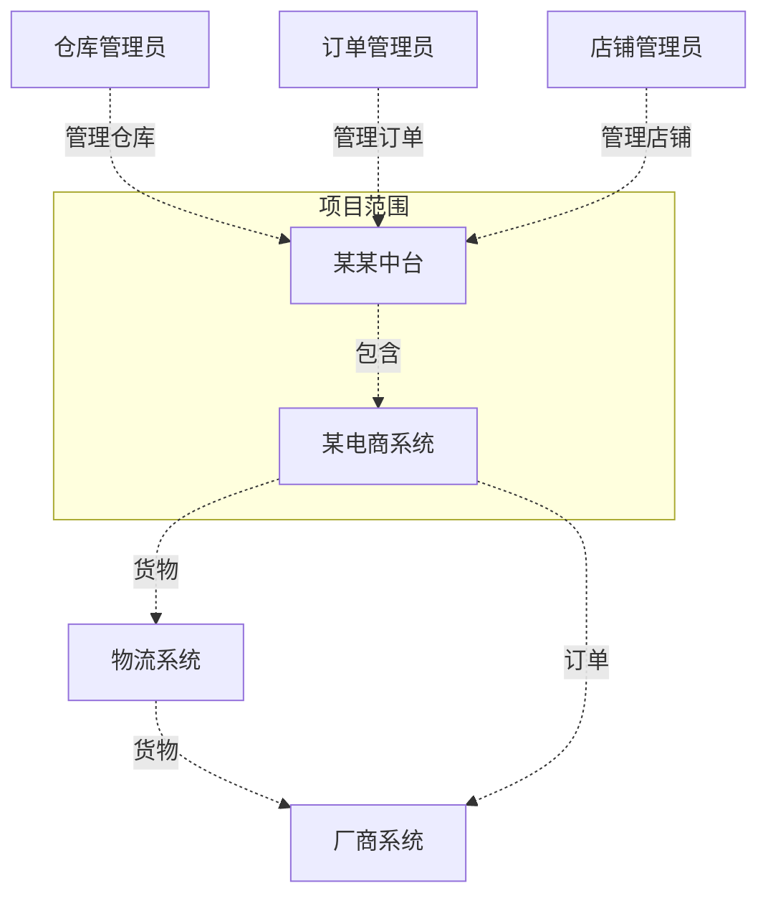
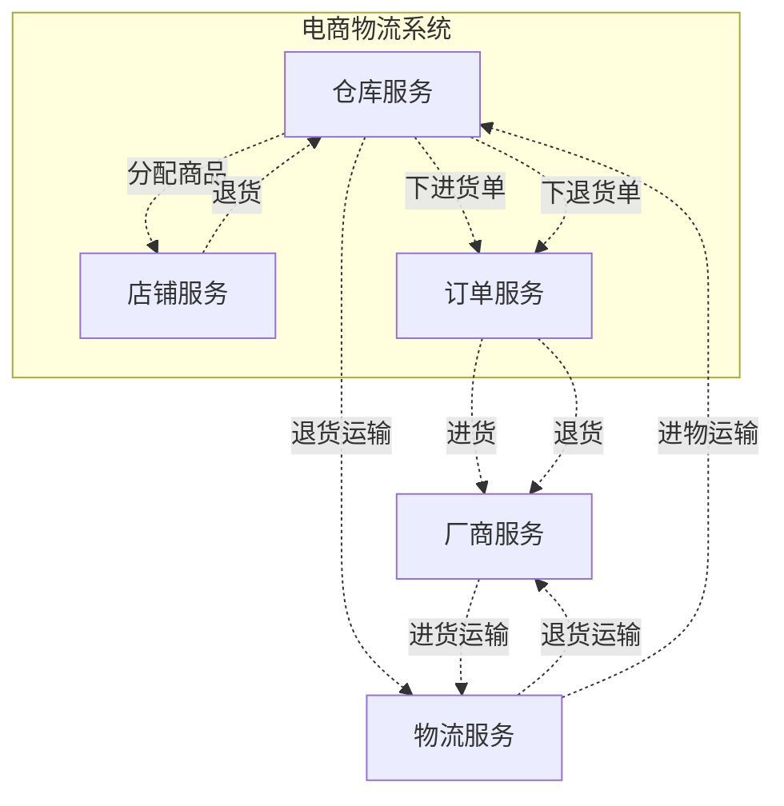
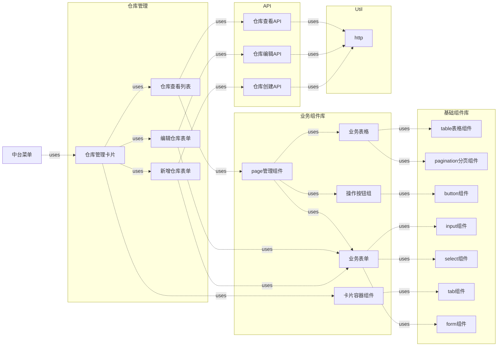

背景简介：
    某某公司基于某某中台的电商物流管理系统，由于项目太大，分多个团队完成，目前所在团队主要负责仓库管理，和订单管理模块的前端部分，所以服务系统整体的简单版本。

A：Context，系统上下文

B: Contianer 服务

C: Component 组件模块(前端组件模块之仓库管理卡片)

1. 从Context能很清楚的看出系统需要依赖的外部服务有“权限系统”，“邮件系统”，“运行数据中心”
2. 从Container能看出，有API网关服务，算法分析服务，报表与告警服务，数据采集服务，web展示应用，存储数据库服务
3. 从Component看出，算法分析服务，有三个组件，定时任务组件，分析组件，算法CURD
感觉还可以补充一下日志服务在Container中，必要的日志有利于问题定位分析

# WELL

1. 尝试使用C4模型来分析系统架构
2. 在Container中对APP端和后端有分类思想

# LESS WELL

没有按照4C的,Context,Container, component个分
   
Context

1. 内外系统没有区分
2. label 描述比较少

Container

1. 与Context区分不明显,
2. APP端或前端层级调用不清晰

component

1. 组件之间关系不清晰

# PUZZLE

1. 系统用的是实线
2. 前端没有服务的如何画container

